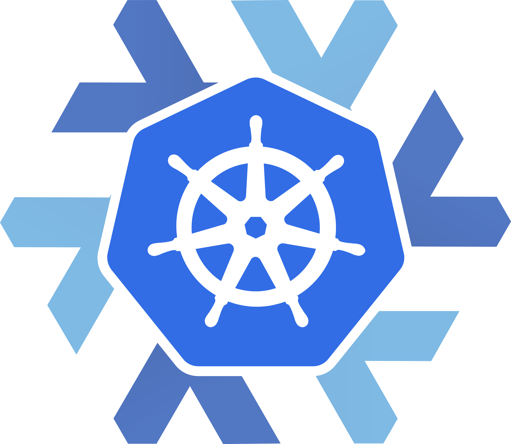

# Kubernix

Kubernix is a [Container Runtime Interface (CRI)](http://blog.kubernetes.io/2016/12/container-runtime-interface-cri-in-kubernetes.html) implementation that allows you to orchestrate native [NixOS containers](http://nixos.org/nixos/manual/#ch-containers) with Kubernetes, without depending on any other containerizer technology.

*_warning_*: It's just a proof of concept for now! Don't use it for anything serious

## Development

### Preparation
1. Because we use `buildGoPackage' nix-shell magic, there is no need to create a `$GOPATH/src/github.com/moretea` directory.
2. Clone the repository
  ```
    git clone git@github.com:moretea/kubernix.git
  ```
3. Enter a nix-shell.
4. Get the dependencies by running
  ```
    dep ensure
  ```
### Building
```
  go build githbub.com/moretea/kubernix
```

### Playing around
```
  rm -f kubernix.sock; ./kubernix -socket ./kubernix.sock
```

- Use the [cri-tools](https://github.com/kubernetes-incubator/cri-tools) that are made available in the nix-shell to play with kubernix.
- Alternatively, run one (or all) of the tests in the [tests](./tests) directory.


## Release
- Doesn't work yet, need to have a godep2nix tool.

## Demo
Nope, it doesn't work yet!
